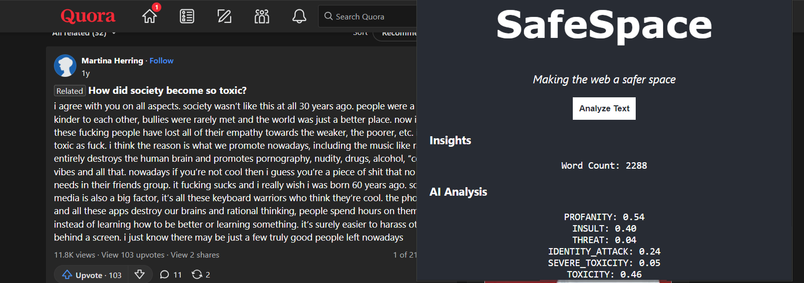

# WELCOME TO SAFESPACE
A web extension leveraging machine learning to battle against cyber bullying

### The Application Uses the Perspective API to scan web pages and present analytics on the content of the application

## Safe Space in action




## Run SAFESPACE locally
- Pull the project from GitHub
- Run the code below
```
    npm install
    npm run build
```

- Head to your Chrome Browser
- Click on extensions
- Select **Load Unpacked**
- Choose the **build** folder of the project directory